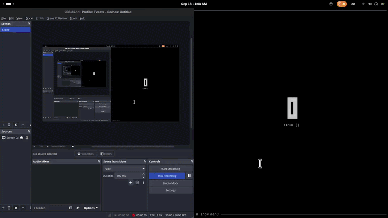

# Pokedex

**A command-line Pokédex** — a REPL over [PokéAPI](https://pokeapi.co) in Go.

A terminal Pokédex that reads commands from stdin and prints results: a `bufio.Scanner` feeds a small REPL that lowercases and splits each line, then dispatches the first token through a command registry whose callbacks share one `Config` (the `next`/`previous` offset-pagination links, an in-memory cache, and the map of caught Pokémon). PokéAPI responses are fetched as raw JSON through a TTL cache and unmarshalled into typed structs. The logic lives in library-shaped `internal/` packages, with a thin `cmd/` binary on top.

## Proof of work

Time-lapse recording of the build session:


*Session — days 29–31*

## Outline

```
.
├── cmd/
│   └── main.go               # entry point: NewConfig() → StartREPL()
├── internal/
│   ├── repl/                 # read-eval-print loop: prompt, cleanInput, dispatch (+ tests)
│   ├── commands/             # command registry, shared Config, the command callbacks
│   ├── pokeapi/              # typed response structs + cached GET helper
│   └── pokecache/            # in-memory TTL cache with a background sweeper
├── assets/                   # build-session GIF
├── go.mod
└── go.sum
```

## What it provides

### REPL — `internal/repl`

- `StartREPL(conf)` is an infinite loop: print `Pokedex > `, `scanner.Scan()`, clean the line, dispatch it. A callback's error is printed and the loop continues, so a failed lookup never ends the session — only `exit` (or a panic) does.
- `cleanInput` lowercases the line, trims spaces, and drops empty tokens, so `  MAP   ` and `map` are the same command and extra spaces between arguments don't matter. This is the one piece of the codebase with unit tests.
- Empty and unknown input is handled before dispatch: an empty line prints `Empty Command isn't Allowed`, an unregistered first token prints `Unknown command`.

### Commands & shared state — `internal/commands`

- `Registry` is a `map[string]cliCommand`, where a `cliCommand` is `{Name, Description, Callback func(*Config, []string) error}`; `GetRegistry()` is the single place where commands are wired up.
- `Config` is the whole shared state: the registry, the `NextMap`/`PrevMap` offset-pagination URLs, the cache, and `Pokedex`, a `map[string]pokeapi.Pokemon` of everything caught. `NewConfig()` seeds it with the first location-area page (`?offset=0&limit=20`) and a 10-minute cache.
- `help` renders itself from the registry — one line of name + description per command — so registering a command in `GetRegistry()` is all it takes to make it show up.
- `map` / `mapb` are **offset pagination**, and a hybrid at that: `NewConfig()` seeds the URL with `?offset=0&limit=20`, but the client never does offset arithmetic of its own — each command fetches the URL it currently holds, prints the 20 names, then stores the response's `next` / `previous` links for the following command, and those links are themselves offset windows (`?offset=20&limit=20`, `?offset=40&limit=20`, …). A `null` link becomes `""`, which prints `No More Location Areas` / `There is No Previous Location Areas` instead of fetching.
- `explore <area>`, `catch <name>`, `inspect <name>`, and `pokedex` are the gameplay commands: list the encounter names for a location area, roll to catch a Pokémon, print the height/weight/stats/types of one already caught, and list the Pokédex.

### Fetching & caching — `internal/pokeapi`, `internal/pokecache`

- `pokeapi.GetObject(key, cache)` is the only network call in the project: cache hit → return the bytes; miss → `http.Get` → `io.ReadAll` → `cache.Add`, keyed by the full URL. Every command goes through it, so a repeated `map` / `explore` / `catch` for the same URL never hits the network twice inside the TTL.
- `pokecache.NewCache(interval)` returns a cache built on `map[string]cacheEntry` (value + `createdAt`) behind a `sync.Mutex`, and starts `ReadLoop()`, a `time.Ticker` that sweeps expired entries every `interval`. `Get` also drops an expired entry on the spot, so a stale key is never returned even before the sweeper runs.
- Response shapes are typed structs rather than maps: `Pokemon` (name, height, weight, base experience, stats, types), `Location` (encounters), `LocationArea` (next / previous / results), and the `namedAPIResource` they share.
- Decoding uses `encoding/json/v2`.

## Commands

| Command | What it does |
| --- | --- |
| `help` | Prints every registered command with its description |
| `map` | Next 20 location areas — fetches the `next` offset link currently held |
| `mapb` | Previous 20 location areas — fetches the `previous` offset link currently held |
| `explore <location-area>` | Lists the Pokémon encounterable in that area |
| `catch <pokemon>` | Rolls to catch it — `rand.Intn(base_experience) <= 40` — and, on success, stores it in the Pokédex |
| `inspect <pokemon>` | Prints height, weight, stats, and types of a caught Pokémon |
| `pokedex` | Lists every caught Pokémon |
| `exit` | Prints a goodbye and calls `os.Exit(0)` |

## Entry points

- **`cmd/main.go`** — the entire binary: `repl.StartREPL(commands.NewConfig())`.
- **Library surface:**
  - `repl.StartREPL(conf *commands.Config)`
  - `commands.NewConfig() *commands.Config` / `commands.GetRegistry() commands.Registry`
  - `pokeapi.GetObject(key string, cache *pokecache.Cache) ([]byte, error)`
  - `pokecache.NewCache(interval time.Duration) *pokecache.Cache` — `Get(key)`, `Add(key, val)`

## How to run

```sh
go run ./cmd
```

Or build a binary (the repo `.gitignore`s it as `Pokedex`):

```sh
go build -o Pokedex ./cmd && ./Pokedex
```

Network access is required — `map`, `mapb`, `explore`, and `catch` all talk to `pokeapi.co`. Requires Go 1.27+ (the module pins `go 1.27.1`, and `internal/commands` imports `encoding/json/v2`).

## Example session

```console
$ go run ./cmd
Pokedex > map
canalave-city-area
eterna-city-area
pastoria-city-area
...
Pokedex > explore eterna-city-area
Exploring eterna-city-area
Found Pokemon:
- psyduck
- golduck
- magikarp
- gyarados
- barboach
- whiscash
Pokedex > catch pikachu
Throwing a Pokeball at pikachu...
pikachu was caught!
Pokedex > pokedex
Your Pokedex:
	- pikachu
Pokedex > inspect pikachu
Name: pikachu
Height: 4
Weight: 60
Stats:
	-hp: 35
	-attack: 55
	-defense: 40
	-special-attack: 50
	-special-defense: 50
	-speed: 90
Types:
	- electric
```

(A catch is a roll of the formula in the table above, so `pikachu escaped!` is a perfectly normal outcome.)

## Notes

- **Arguments are required.** `explore`, `catch`, and `inspect` check `len(parameters) < 1` and then index `parameters[1]`, so calling any of them bare panics the REPL (`index out of range [1] with length 1`); the error text also says "expected 2" for what is really an "at least 2" check.
- **HTTP status is never checked.** `GetObject` returns whatever body came back, so a name that doesn't exist decodes into a zero-value struct rather than an error: `explore` prints an empty `Found Pokemon:`, and `catch` panics on `rand.Intn(0)`.
- **Nothing is persisted.** Caught Pokémon, the pagination links, and the cache live in memory for the session only — quitting starts a fresh Pokédex, which is all this CLI exercise needs.
- Tests live next to the package they cover: `internal/repl` has a table-driven `TestCleanInput` (case folding, extra whitespace, empty input) written with the standard library only — no third-party test dependency.

```sh
go test ./...
```
